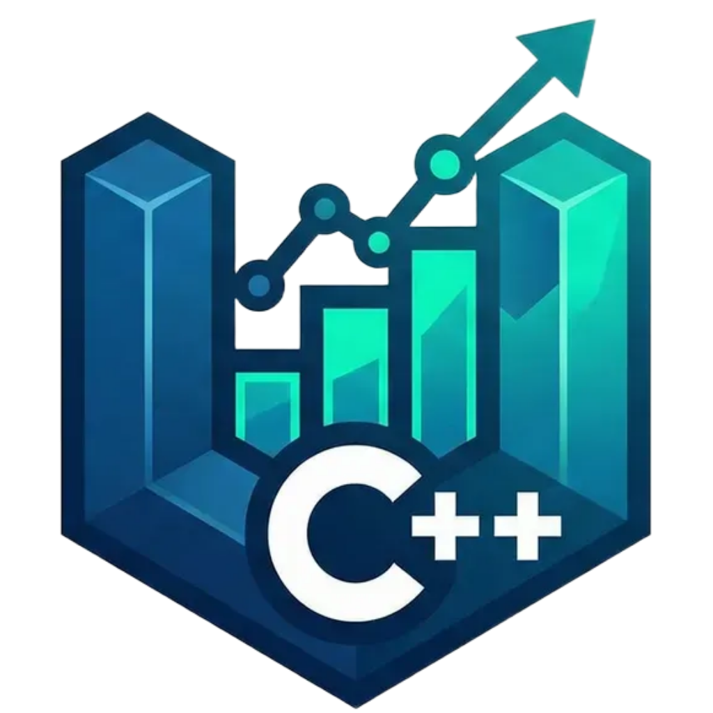
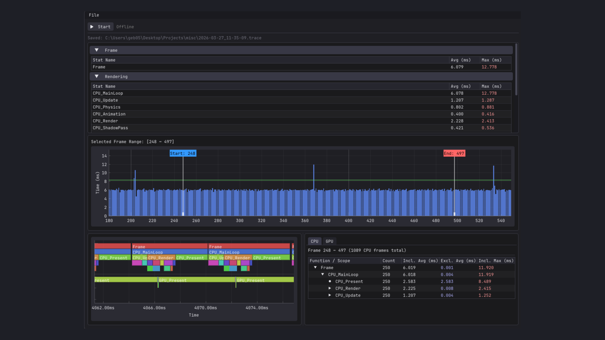
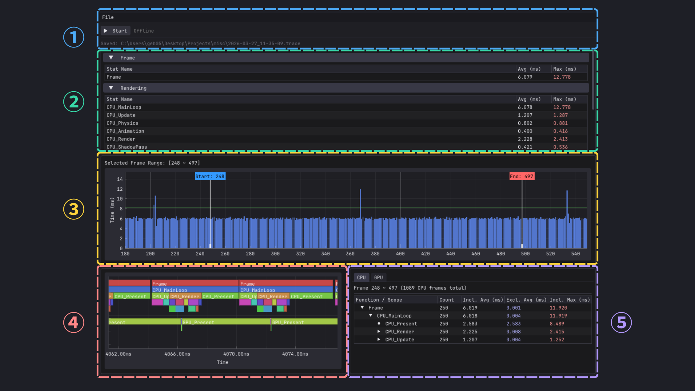

<div align="center">
  
  <h1>cpp-insights</h1>
  <p>게임 및 실시간 애플리케이션을 위한 C++ 실시간 성능 프로파일링 프레임워크</p>

  [](https://www.microsoft.com/windows)
  [](https://en.cppreference.com)
  [](LICENSE)
  [](https://cmake.org)

  [English](README.md)
</div>

---



## Overview

**cpp-insights**는 실시간 C++ 애플리케이션을 위한 non-intrusive 경량 프로파일링 프레임워크입니다. 몇 가지 매크로로 코드를 계측한 뒤, Viewer에서 CPU 및 GPU 성능 데이터를 실시간으로 시각화할 수 있습니다.

## Features

- **RAII 기반 scope 타이밍** — 매크로 하나로 임의의 코드 경로를 계측합니다. 타이밍은 scope 진입/종료 시 자동으로 시작/종료되며 별도의 수동 호출이 필요 없습니다.
- **Non-intrusive 비동기 전송** — 프레임 데이터는 IPC를 통해 Viewer로 스트리밍되며 게임 루프를 블로킹하지 않습니다. 녹화와 분석은 별도 프로세스에서 실행됩니다.
- **CPU & GPU 프로파일링** — CPU scope와 D3D11 GPU scope를 통합 나노초 타임라인에 기록하여 CPU와 GPU 작업을 나란히 분석할 수 있습니다.
- **풍부한 통계 분석** — 프레임별 분석, 실시간 프레임 타임 모니터, 계층적 Flame Graph, inclusive/exclusive 타이밍 및 avg / min / max / p95 / p99 통계를 제공합니다.
- **세션 저장 / 불러오기** — 녹화 세션을 디스크에 저장하고 나중에 오프라인으로 다시 열 수 있습니다.
- **최소한의 클라이언트 오버헤드** — 클라이언트 라이브러리는 외부 의존성이 없습니다. GPU 프로파일링은 컴파일 타임 플래그로 선택적으로 활성화하며 D3D11 링크 의존성만 추가됩니다.

## Implementation Notes

- **이중 파이프 IPC** — 전용 데이터 파이프(클라이언트 → 서버)가 프레임 페이로드를 전달하고, 별도의 제어 파이프(서버 → 클라이언트)가 세션 명령을 처리합니다. 데이터 흐름과 세션 제어가 같은 채널을 공유하지 않습니다.
- **Producer-Consumer 송신 큐** — `std::mutex` + `std::condition_variable`로 게임 스레드와 송신 worker를 분리합니다. 게임 스레드는 프레임을 큐에 넣고 즉시 반환하며, 백그라운드 스레드가 전송을 처리합니다.
- **D3D11 타임스탬프 쿼리** — scope별 `ID3D11Query` 타임스탬프 쌍을 3프레임 순환 버퍼로 관리하여 GPU 파이프라인 레이턴시를 흡수합니다. Disjoint 쿼리로 GPU 컨텍스트 손실을 감지하고 손상된 샘플을 폐기합니다.
- **통합 CPU / GPU 타임라인** — GPU 틱을 Disjoint 쿼리 주파수와 보정된 기준 틱을 사용해 나노초로 변환하여 CPU와 GPU scope를 동일한 시간 축에 배치합니다.
- **커스텀 바이너리 직렬화** — 단일 `Archive` 기반 클래스가 `IsLoading()` 플래그를 통해 직렬화와 역직렬화를 하나의 `operator<<` 체인으로 통합합니다. 외부 라이브러리 없이 구현되었습니다.

## Viewer



**① Toolbar** — 실행 중인 클라이언트와의 연결을 관리하고, 녹화 시작/종료 및 세션 저장/불러오기를 제공합니다.

**② Real-time Frame Monitor** — 녹화 중 실시간으로 업데이트되는 스크롤 프레임 타임 그래프입니다. 히치와 프레임 페이싱 문제를 즉시 포착할 수 있습니다.

**③ Frame Timeline** — stat별 프레임 단위 타이밍을 표시합니다. 실시간 그래프에서 임의의 프레임을 선택하여 시간이 어디서 소비됐는지 확인할 수 있습니다.

**④ Flame Graph** — 전체 녹화 구간에 걸친 CPU & GPU scope 계층 시각화입니다. scope 위에 마우스를 올리면 이름, 소요 시간, 깊이, 프레임 번호를 확인할 수 있습니다.

**⑤ Call Stack** — stat descriptor별 inclusive/exclusive 타이밍 및 호출 횟수를 포함한 call tree입니다. 중첩 scope의 실제 비용을 파악하는 데 유용합니다.

## Requirements

| 구성 요소 | 최소 버전 |
|-----------|---------|
| OS | Windows 10 / 11 |
| 컴파일러 | MSVC 2019+ |
| DirectX | D3D11 (Viewer + GPU 프로파일링) |

## Getting Started

### Option 1 — 사전 빌드 다운로드

[Releases](https://github.com/geb0598/cpp-insights/releases)에서 최신 릴리스를 다운로드합니다:

- **`cpp-insights-vX.Y.Z-viewer.zip`** — 압축 해제 후 `cpp-insights-viewer.exe` 실행
- **`cpp-insights-vX.Y.Z-sdk.zip`** — 연동을 위한 헤더 및 사전 빌드 라이브러리

**Visual Studio 연동:**

1. `sdk/include/`를 **Additional Include Directories**에 추가
2. `sdk/lib/Release/`를 **Additional Library Directories**에 추가
3. `cpp-insights-core.lib`를 **Additional Dependencies**에 추가
4. `INSIGHTS`를 **Preprocessor Definitions**에 추가

GPU 프로파일링을 사용하려면 `cpp-insights-gpu.lib`와 `INSIGHTS_GPU`도 추가합니다.

> 사전 빌드 라이브러리는 MSVC 2022, `/MD` 런타임 기준으로 빌드되었습니다. 링커 오류가 발생하면 Option 2를 통해 소스에서 직접 빌드하세요.

### Option 2 — 소스에서 빌드

```bash
git clone https://github.com/geb0598/cpp-insights.git
cd cpp-insights

cmake --preset release
cmake --build build/release --preset release
```

Viewer는 `build/release/viewer/Release/cpp-insights-viewer.exe`에 생성됩니다.

---

## Usage

**1단계 — Stat group 및 stat 선언** (임의의 번역 단위에서 1회)

```cpp
#include "insights/insight.h"

INSIGHTS_DECLARE_STATGROUP("Rendering",  GRenderGroup);

INSIGHTS_DECLARE_STAT("Draw Calls",  GDrawCallsStat,  GRenderGroup);
INSIGHTS_DECLARE_STAT("Shadow Pass", GShadowStat,     GRenderGroup);
```

**2단계 — 시작 시 초기화**

```cpp
// CPU 프로파일링만
INSIGHTS_INITIALIZE();

// D3D11 GPU 프로파일링 포함
INSIGHTS_GPU_INIT_D3D11(pDevice, pContext);
INSIGHTS_INITIALIZE();
```

**3단계 — 프레임 루프 계측**

```cpp
while (running) {
    INSIGHTS_FRAME_BEGIN();

    {
        INSIGHTS_SCOPE(GDrawCallsStat);
        // ... 렌더링 코드 ...
    }
    {
        INSIGHTS_GPU_SCOPE(GShadowStat);
        // ... GPU 작업 ...
    }

    INSIGHTS_FRAME_END();
}
```

> `INSIGHTS_GPU_SCOPE`는 생성 시마다 D3D11 타임스탬프 쿼리 쌍을 발행합니다. 쿼리 오버헤드를 낮게 유지하려면 드로우 콜 단위가 아닌 패스 단위로 scope를 사용하세요.
>
> ```cpp
> // ❌ 비권장 — 드로우 콜마다 쿼리 쌍 발행
> for (auto& mesh : meshes) {
>     INSIGHTS_GPU_SCOPE(GMeshStat);
>     DrawMesh(mesh);
> }
>
> // ✅ 권장 — 전체 패스에 쿼리 쌍 하나
> {
>     INSIGHTS_GPU_SCOPE(GMeshStat);
>     for (auto& mesh : meshes) {
>         DrawMesh(mesh);
>     }
> }
> ```

**4단계 — 종료**

```cpp
INSIGHTS_SHUTDOWN();
```

`cpp-insights-viewer.exe`를 실행하고 **Connect**를 클릭하면 실시간 프로파일링 세션이 시작됩니다.

> Shipping 빌드 등에서 모든 프로파일링을 zero overhead로 비활성화하려면 `INSIGHTS` 전처리기 정의를 제거하세요. 모든 매크로가 빈 문자열로 컴파일됩니다.

## Roadmap

- [ ] 멀티스레드 프로파일링 — `ScopeProfiler`는 현재 단일 스레드 프레임 녹화를 가정합니다

## Acknowledgements

- [JetBrains Mono](https://www.jetbrains.com/lp/mono/) — [SIL Open Font License 1.1](OFL.txt)
- [Dear ImGui](https://github.com/ocornut/imgui) — MIT License
- [ImPlot](https://github.com/epezent/implot) — MIT License

## License

[MIT License](LICENSE) 하에 배포됩니다. © 2026 geb0598
